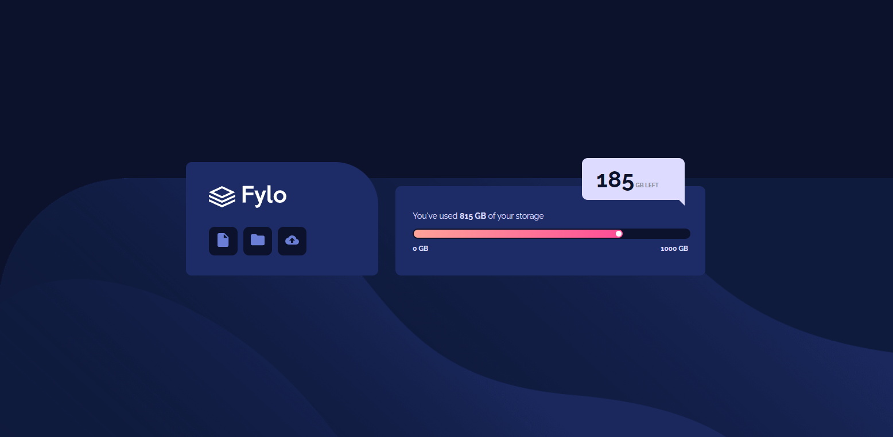

#a002

# Frontend Mentor - Fylo data storage component solution 

This is a solution to the [Fylo data storage component challenge on Frontend Mentor](https://www.frontendmentor.io/challenges/fylo-data-storage-component-1dZPRbV5n). Frontend Mentor challenges help you improve your coding skills by building realistic projects. 

## Table of contents

- [Overview](#overview)
  - [Screenshot](#screenshot)
  - [Links](#links)
- [My process](#my-process)
  - [What I learned](#what-i-learned)
  - [Continued development](#continued-development)

## Overview

### screenshot



### Links

- Live Site URL: ()

## My process

### Built with

- Semantic HTML5 markup
- CSS custom properties
- Flexbox

### What I learned

```html
<div class="range">
            <div class="range-indicator">
              <div class="range-pointer"></div>
            </div>
          </div>
```

```css
.range {
  background-color: var(--cor3);
  border-radius: 10px;
  width: 100%;
  padding: 2px;
}
.range-indicator {
  background-image: linear-gradient(
    to right,
    hsl(6, 100%, 80%),
    hsl(335, 100%, 65%)
  );
  width: 75%;
  border-radius: 10px;
  padding: 2px;
  display: flex;
  justify-content: flex-end;
}
.range-pointer {
  background-color: white;
  border-radius: 50%;
  width: 10px;
  height: 10px;
}
```

### Continued development
 
- Continue learing Html and Css
- Start learning Js


 
